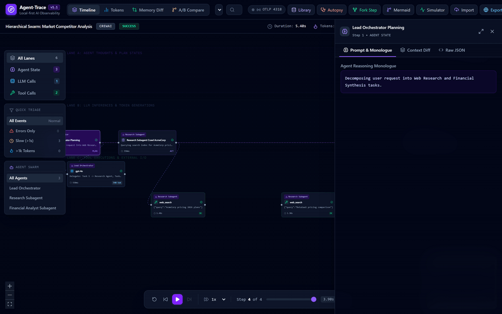
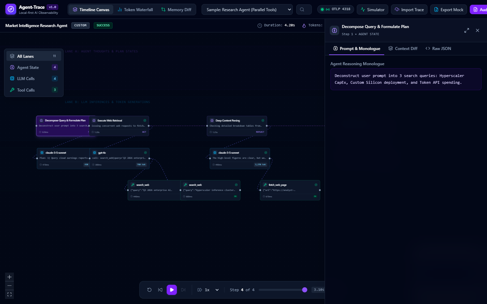
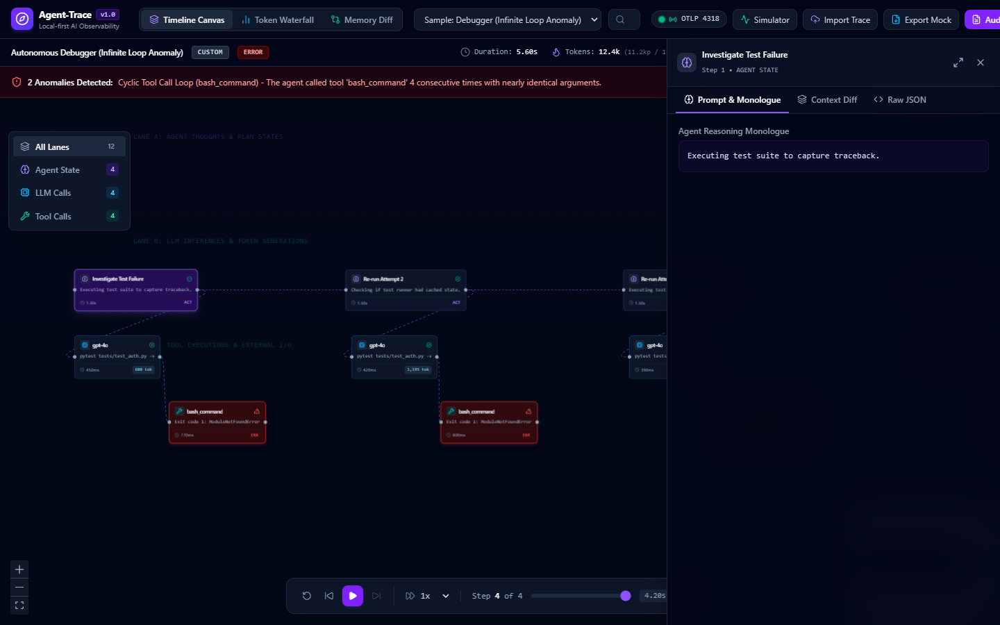
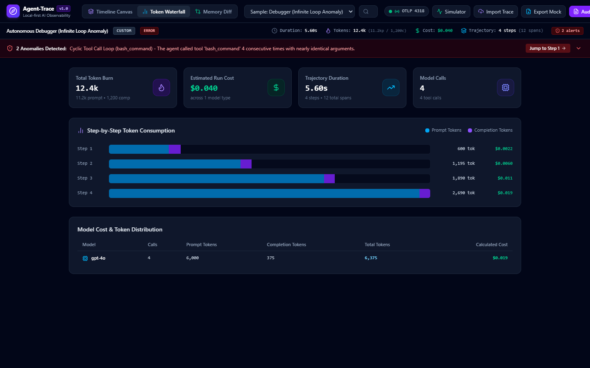
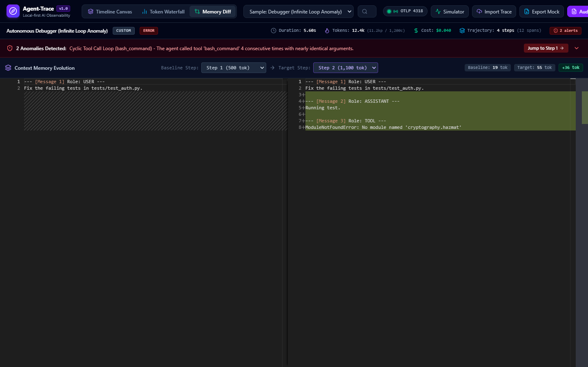
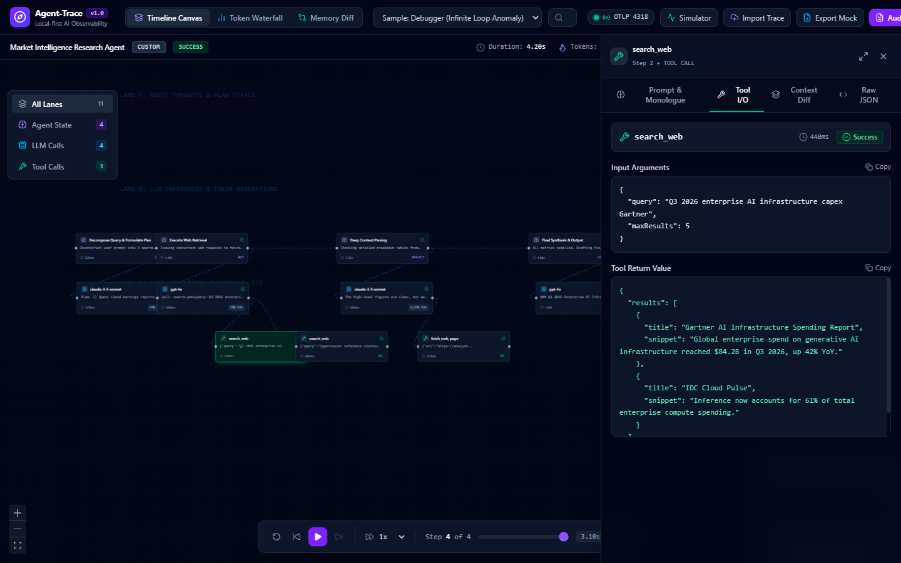

# Agent-Trace

Local-first visual timeline and debugger for AI agent trajectories. Ingests OpenTelemetry GenAI spans and LangChain runs, rendering multi-lane execution graphs with context memory diffing, loop detection, and cost accounting.



## Why Agent-Trace

Autonomous AI agents run as non-deterministic state machines. When an agent loops on a shell command, hallucinates tool arguments, or dumps an unformatted table into its prompt, terminal logs become difficult to follow.

Cloud observability platforms require streaming proprietary customer prompts and internal documents to third-party endpoints, or running heavyweight server stacks with PostgreSQL and ClickHouse. Agent-Trace runs locally in the browser with zero cloud dependencies. You drop a trace file, review the execution graph, and inspect prompt bloat immediately.

## Key Features

- **Multi-lane timeline canvas**: Tracks agent reasoning steps, model completions, and tool calls across synchronized visual rows built with React Flow.
- **Context memory diff engine**: Compares prompt and context growth step by step in Monaco Editor. Highlights tokens added by tool executions and flags context bloat exceeding threshold limits.
- **Loop and anomaly detection**: Flags cyclic tool execution loops, argument thrashing, and elevated failure rates.
- **Token waterfall and cost profiler**: Calculates cumulative token burn curves and dollar costs across GPT-4o, Claude 3.5 Sonnet, Gemini, DeepSeek, and local Ollama models.
- **Multi-format ingestion**: Reads OpenTelemetry (OTLP) HTTP JSON payloads, LangChain run trees, and custom JSON/JSONL traces.
- **Mock fixture export**: Exports sanitized execution runs as standalone JSON fixtures for reproducible regression tests in CI pipelines.
- **Interactive trajectory scrubber**: Step forward, step back, or play through the trajectory at 0.5x to 4x playback speed.

## Interface Tour

### Timeline canvas and agent thought inspection


### Automated infinite loop detection


### Token waterfall and model cost profiler


### Context window memory diffing with Monaco Editor


### Tool execution I/O drawer


## Quick Start

### Installation

Clone the repository and install dependencies:

```bash
git clone https://github.com/alexandrmotologa/agent-trace.git
cd agent-trace
npm install
```

### Development server

Start Vite dev server:

```bash
npm run dev
```

Open `http://localhost:5173` in your browser.

### Running tests

Run the unit and integration suite:

```bash
npm run test
```

### Production build

Compile the TypeScript bundle and production assets:

```bash
npm run build
```

## Supported Trace Formats

### 1. OpenTelemetry (OTLP) GenAI conventions

Agent-Trace accepts OTLP trace payloads conforming to the OpenTelemetry Generative AI semantic conventions (`gen_ai.system`, `gen_ai.request.model`, `gen_ai.usage.prompt_tokens`, `gen_ai.tool.name`).

Point your OpenTelemetry exporter to your local endpoint:

```bash
export OTEL_EXPORTER_OTLP_ENDPOINT="http://localhost:4318"
```

### 2. LangChain run exports

Export runs directly from LangChain or LangSmith client:

```python
from langchain_core.tracers import RunCollectorCallbackHandler

handler = RunCollectorCallbackHandler()
# Execute agent with callbacks=[handler]
# Export runs: [run.dict() for run in handler.traced_runs]
```

Drop the resulting `.json` file directly into the Agent-Trace interface.

### 3. Agent-Trace native format

You can also record runs in JSON or JSONL format matching the schema in `src/types/trace.ts`:

```json
{
  "runId": "trace-101",
  "name": "Research Agent Run",
  "startTimeMs": 0,
  "endTimeMs": 3200,
  "durationMs": 3200,
  "status": "success",
  "steps": [ ... ],
  "spans": [ ... ]
}
```

## Architecture

The project is structured into modular engines:

- `src/engine/normalizer.ts`: Unifies OTLP, LangChain, and custom JSON/JSONL inputs into a standardized `AgentRun` model.
- `src/engine/loopDetector.ts`: Analyzes tool arguments and state sequences to identify infinite retry loops, oscillation between two tools, and sudden context explosions.
- `src/engine/costEngine.ts`: Tracks token pricing for OpenAI, Anthropic, Google Gemini, DeepSeek, and self-hosted models.
- `src/engine/diffEngine.ts`: Formats message history and calculates line/token differentials for Monaco Diff Editor.
- `src/store/traceStore.ts`: Zustand store managing active run state, playback position, filtering, and anomalies.

## License

MIT License. See [LICENSE](LICENSE) for details.
